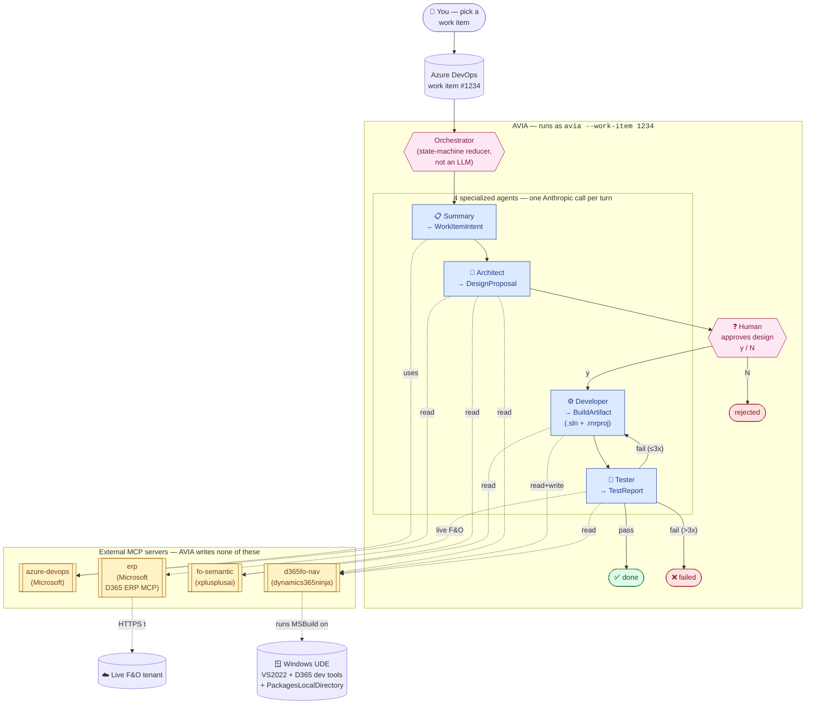
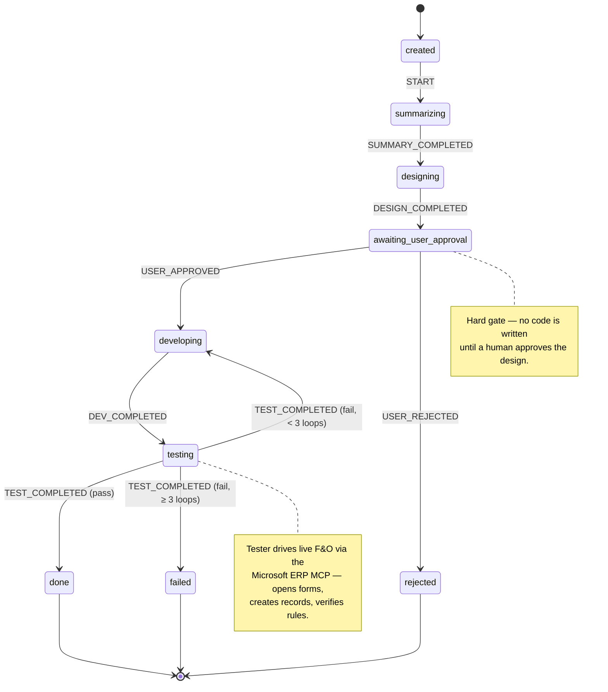
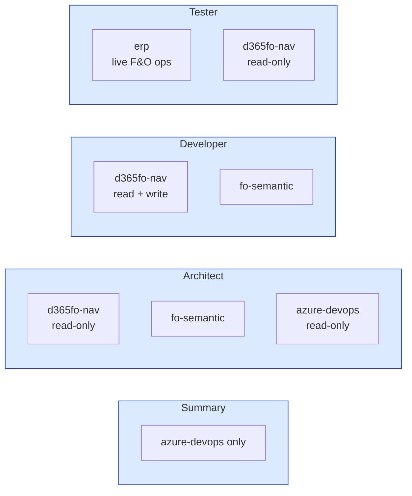

# AVIA — Architecture Overview (Visual)

A picture-first reference. For prose-level architecture see `architecture.md`;
for per-agent prompts see `agents.md`; for MCP tool contracts see
`mcp-contracts.md`.

## End-to-end pipeline



## Task lifecycle (state machine)



## Tool surface per agent (least-privilege)



Filtering happens at construction: each agent calls
`registry.toolsFor(...)` with only the servers it's allowed to touch.
The other tools are literally not visible to that agent's LLM.

## Output contract (the "VS2022-shaped" promise)

```mermaid
flowchart TB
    Dev[⚙️ Developer agent] --> BA[BuildArtifact]
    BA --> SP[solutionPath:<br/>absolute .sln path]
    BA --> Pj[projects[]:<br/>one .rnrproj per touched model]
    BA --> Cfg[configuration:<br/>Debug | Release]
    BA --> CL[compileLog:<br/>full MSBuild output]
    BA --> DI[deploymentId<br/>+ deployedAt]
    SP --> Reviewer[👀 Human reviewer<br/>opens .sln in VS2022<br/>just like any PR]
    Pj --> Reviewer
    classDef out fill:#fef3c7,stroke:#a16207
    class BA out
```

The `BuildArtifact` Zod schema (in `packages/shared-types/src/index.ts`)
forces every successful run to emit a **standard VS2022 solution + Dynamics
365 F&O project**. A reviewer can open the `.sln` and see exactly what
AVIA built — no special tooling needed.
